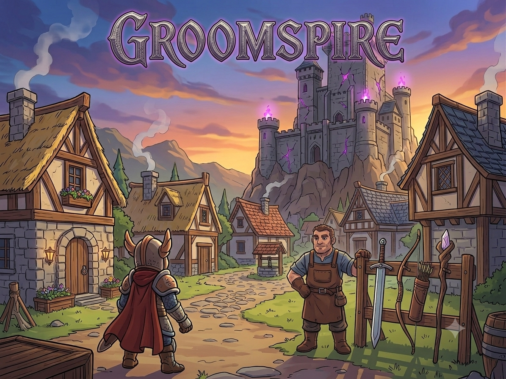

<h1 align="center">Groomspire</h1>

<!--  -->


O GroomSpire é um projeto que tem como objetivo integrar os conceitos de programação estudados em Linguagem C.
O Projeto utiliza o Console como único meio de interação com o usuário, mostrando tudo com tabela ASCCI.
No fim, tudo se resume a uma aplicação prática, criativa e funcional. Incentivando a criatividade.

## História
Uma vila, no reino de Eldoria, foi tomada por criaturas que surgiram das profundezas de uma antiga masmorra, juntamente do seu líder, O Cavaleiro Maligno. O jogador assume o papel de um aventureiro que deve atravessar três andares repletos de desafios para derrotar o grande chefe e restaurar a paz. Em sua aventura, ele recebe os ensinamentos de Edward, um sábio morador da vila que tem breves conhecimentos de combate e conseguiu capturar uma criatura em seu campo de treinamento.

## Objetivo

- Explorar a vila.
- Escolher uma arma.
- Sobreviver aos andares da masmorra.
- Derrotar o boss final.

## Como Jogar

### Controles

| Tecla | Ação |
|---------|---------|
| W | Mover para cima |
| A | Mover para esquerda |
| S | Mover para baixo |
| D | Mover para direita |
| E | Interagir |
| I | Abrir Inventário |
| O | Atacar |

### Sistema de Vidas

O jogador possui 3 vidas. Ao tocar em espinhos ou monstros, perde uma vida e retorna ao início da fase.

## Armas

### ⚔️ Espada
Ataque em Área na frente do Jogador. 6 Células (2x3); </br>

### VERTICAL


### HORIZONTAL
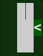

### 🏹 Arco e Flecha
Ataque Reto na frente do Jogador. 4 Células (1x4); </br>

### VERTICAL


### HORIZONTAL
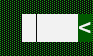

### 🪄 Cajado
Ataque em Área em volta do Jogador. 8 Células; </br>

### VERTICAL


### HORIZONTAL
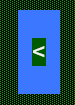

## Símbolos do Jogo

| Símbolo | Significado |
|----------|-------------|
| ^ < > v &| Jogador |
| ■ | Parede |
| # | Espinho |
| k | Caixa |
| O | Botão |
| o | Botão Pressionado |
| D | Porta Fechada |
| = | Porta Aberta |
| @ | Chave |
| L | Escada |
| ☻ | NPC (Edward) |
| ⍙ | Poção de Vida |
| ⚇ | Monstro Tipo 1 |
| ⍾ | Monstro Tipo 2 |
| ⌹ | Boss Final |

## Estrutura das Fases

### Vila
Local onde o Jogador inicia sua jornada. Ele encontra um NPC que será seu guia e o ajudará a entender os perigos desse mundo.
Também é um local que ele sente que deve proteger, por isso ele segue subindo os andares da Torre.

### Andar 1
O Primeiro andar conta com algums monstros que se movimentam sem considerar a presença do jogador. Mas ainda sim são perigosos e causam dano ao encostarem no Jogador.

### Andar 2
O Segundo andar conta com algums monstros mais inteligente, que peseguem o jogador a medida que ele se aproxima. São bem perigosos e bem espertos. Além do Cavaleiro Maligno, que tenta advinhar quando o jogador vai atacá-lo e tenta desviar de possíveis golpes.

## Tecnologias Utilizadas

- Linguagem C
- Console ASCII
- Git
- GitHub
  
## Como Executar

```bash
gcc main.c -o GroomSpire
./GroomSpire
```

## Capturas de Tela

### MENU


### TUTORIAL

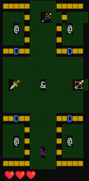

### FINISH TUTORIAL

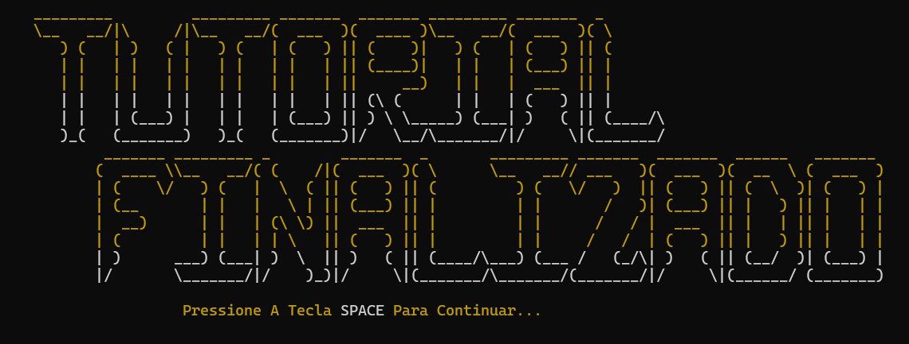

### TELA DE GAMEOVER

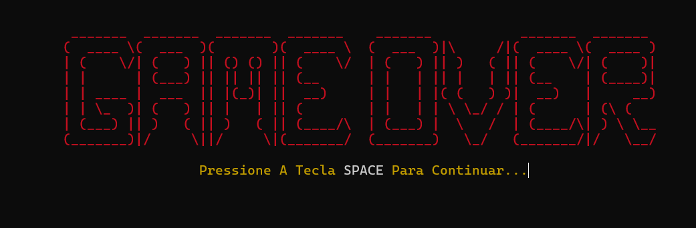

### MAPA DA VILA

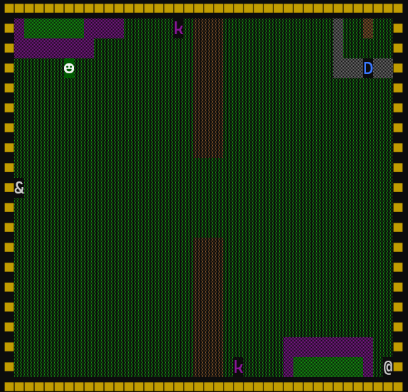

### 1º ANDAR DUNGEON

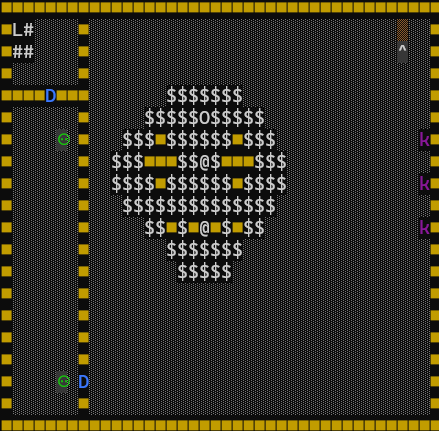

### 2º ANDAR DUNGEON

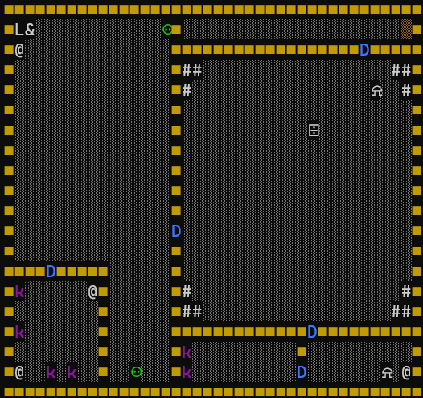
(Imagens do menu, vila e masmorra)

### TELA DE FINALIZAÇÃO DO JOGO 

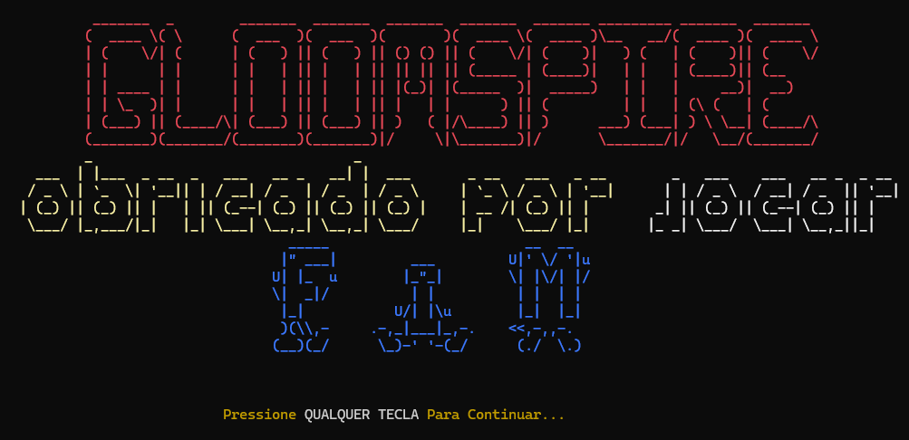

## Status

O projeto está atualmente em versão:

```txt
Beta 2.0
```

Esta versão apresenta um mapa genérico de Tutorial com algumas interações limitadas, movimentação do Player, funcionalidade das Armas e Monstro tipo 1, com o objetivo de ajudar no aprendizado das funções basicas de Jogo. Além de uma mapa genérico de Vila, com a presença de um Personagem Não Jogável (NPC), que ajudará o jogador em sua jornada pelo mundo de ELDORIA.

Esta versão também apresenta dois andares da Masmorra, com criaturas perigosas, puzzles, desafios com espinhos e botões para desafiar o jogador.  

---

⚙️ Requisitos

- Compilador C (ex: GCC, MinGW)
- Sistema Operacional: Windows (utiliza `<windows.h>` para `Sleep()` e `system("cls")`)

⚠️ O código **não é compatível com Linux/macOS** por depender de `windows.h`.

## Roadmap

### Versão 1.0

* [x] Movimentação do Player
* [x] Atualização de Mapa em Tempo Real
* [x] Tutorial com Funcionalidades Básicas 
* [x] Inventário do Player funcional 
* [x] Menu Inicial com Todas as Opções Funcionando
* [x] Ataque Individual de Cada Arma
* [x] Diálogos de Tutorial
* [x] Inimigos nivel 1 
* [x] Vida do Player
* [x] Tela de Game Over
* [x] Vila com NPC(s) e Casas
* [x] Espinhos de Masmorra
* [x] Regeneração de Vida do Player
* [x] Masmorra Nível 1
* [x] Masmorra Nível 2
* [x] Masmorra Nível 3
* [x] Inimigos nivel 2 (Nivel de Perseguição médio)
* [x] Algoritmo de Perseguição do Boss Final

### Versão 2.0

* [ ] Itens Deixados por Inimigos
* [x] Trilhas Sonoras entre Mapas
* [ ] Equipamentos
  * [ ] Armaduras
  * [x] Poções 
* [ ] Habilidades de Dash e Corrida
* [ ] Ataques Especiais com Armas
* [ ] Pets (Player se sente Sozinho)
---

## Objetivo

O **GroomSpire** é mais do que uma atividade de Universidade.

Ele foi criado para ajudar estudantes a treinarem racicínio lógico, resolver problemas, lidar com desafios e desenvolver autonomia.

## Autor

Desenvolvido por **Eduardo Cajueiro**. 

Projeto criado com o objetivo de praticar e fixar conteúdos de programação em C. Além de construir um algoritmo divertido para compartilhar com amigos.

## Declaração de IA Generativa

O Uso e IA Generativa no projeto foi empregado apenas para criação da Imagem de Banner incluída no README do repositório e para reformatação de Strings de ASCIIs utilizados no código em Menus e Telas Personalizadas. O Código oficial do projeto, presente no repositório, não conta com uso de IA Generativa em sua elaboração lógica.

---

<div align="center">
  <p>
    <strong>GroomSpire</strong>
  </p>

  <p>

  </p>
</div>

## Licença

Projeto acadêmico desenvolvido para a disciplina de Programação.
