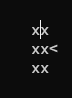
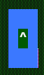
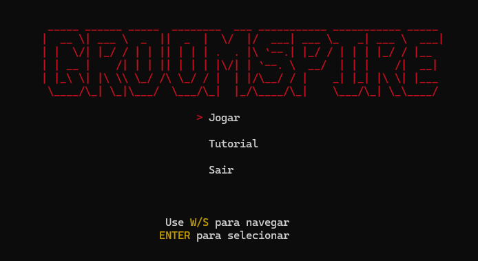

#  GROOMSPIRE 


O GroomSpire é um projeto que tem como objetivo integrar os conceitos de programação estudados em Linguagem C.
O Projeto utiliza o Console como único meio de interação com o usuário, mostrando tudo com tabela ASCCI.
No fim, tudo se resume a uma aplicação prática, criativa e funcional. Incentivando a criatividade.

## História

Contexto do jogo.

## Objetivo

- Explorar a vila.
- Escolher uma arma.
- Sobreviver aos três andares da masmorra.
- Derrotar o boss final.

## Como Jogar

### Controles

| Tecla | Ação |
|---------|---------|
| W | Mover para cima |
| A | Mover para esquerda |
| S | Mover para baixo |
| D | Mover para direita |
| E | Interagir |
| I | Abrir Inventário |
| O | Atacar |

### Sistema de Vidas

O jogador possui 3 vidas. Ao tocar em espinhos ou monstros, perde uma vida e retorna ao início da fase.

## Armas

### ⚔️ Espada
Ataque em Área na frente do Jogador. 6 Células (2x6); </br>


### 🏹 Arco e Flecha
Ataque Reto na frente do Jogador. 6 Células (1x4); </br>


### 🪄 Cajado
Ataque em Área em volta do Jogador. 8 Células; </br>


## Símbolos do Jogo

| Símbolo | Significado |
|----------|-------------|
| ^ < > v | Jogador |
| * | Parede |
| # | Espinho |
| k | Caixa |
| O | Botão |
| o | Botão Pressionado |
| D | Porta Fechada |
| = | Porta Aberta |
| @ | Chave |
| L | Escada |
|🧌 | Monstro Tipo 1 |
| Y | Monstro Tipo 2 |
| Z | Boss Final |

## Estrutura das Fases

### Vila
Local onde o Jogador inicia sua jornada. Ele encontra um NPC que será seu guia e o ajudará a entender os perigos desse mundo.
Também é um local que ele sente que deve proteger, por isso ele segue subindo os andares da Torre.

### Andar 1
Descrição dos desafios.

### Andar 2
Descrição dos desafios.

### Andar 3
Descrição dos desafios e do boss.

## Tecnologias Utilizadas

- Linguagem C
- Console ASCII
- Git
- GitHub
  
## Como Executar

```bash
gcc main.c -o GroomSpire
./GroomSpire
```

## Capturas de Tela

### MENU



(Imagens do menu, vila e masmorra)


## Status

O projeto está atualmente em versão:

```txt
Beta 1.3
```

Esta versão apresenta um mapa genérico de Tutorial com algumas interações limitadas, movimentação do Player, funcionalidade das Armas e Monstro tipo 1.

---

## Roadmap

### Versão 1.0

* [x] Movimentação do Player
* [x] Atualização de Mapa em Tempo Real
* [x] Tutorial com Funcionalidades Básicas 
* [x] Inventário do Player funcional 
* [x] Menu Inicial com Todas as Opções Funcionando
* [x] Ataque Individual de Cada Arma
* [x] Diálogos de Tutorial
* [x] Inimigos nivel 1 
* [x] Vida do Player
* [ ] Tela de Game Over
* [ ] Vila com NPC(s) e Casas
* [ ] Niveis da Masmorra
* [ ] Regeneração de Vida do Player
* [ ] Inimigos nivel 2 (Nivel de Perseguição médio)
* [ ] Algoritmo de Perseguição do Boss Final

### Versão 2.0

* [ ] Itens Deixados por Inimigos
* [ ] Trilhas Sonoras entre Mapas
* [ ] Equipamentos
  * [ ] Armaduras
  * [ ] Poções 
* [ ] Habilidades de Dash e Corrida
* [ ] Ataques Especiais com Armas
* [ ] Pets (Player se sente Sozinho)
---

## Objetivo

O **GroomSpire** é mais do que uma atividade de Universidade.

Ele foi criado para ajudar estudantes a treinarem racicínio lógico, resolver problemas, lidar com desafios e desenvolver autonomia.

## Autor

Desenvolvido por **Eduardo Cajueiro**. 

Projeto criado com o objetivo de praticar e fixar conteúdos de programação em C. Além de construir um algoritmo divertido para compartilhar com amigos.

---

<div align="center">
  <p>
    <strong>GroomSpire</strong>
  </p>

  <p>

  </p>
</div>

## Licença

Projeto acadêmico desenvolvido para a disciplina de Programação.
